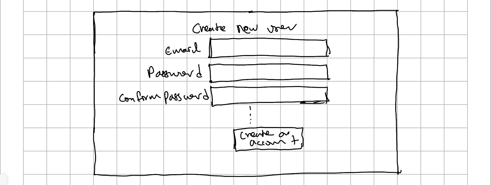
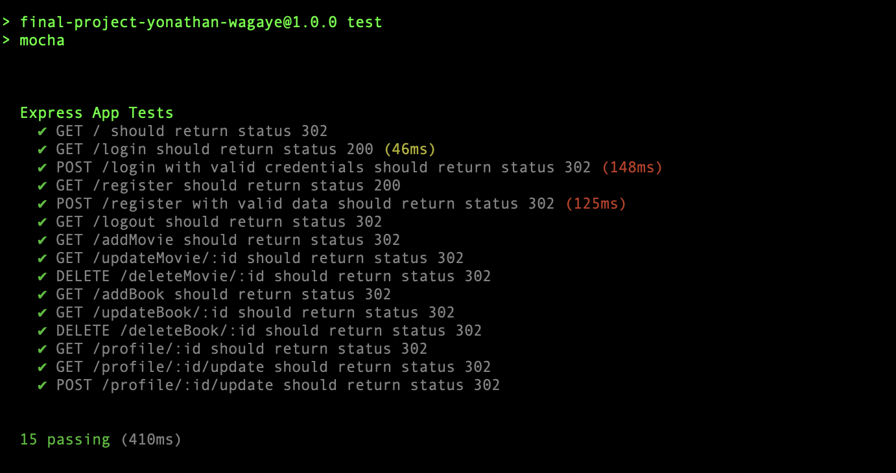

# Vellum

## Overview


Many of us often find ourselves struggling to make a decision when it comes to choosing a movie or a book, despite the convenience of streaming platforms and their recommendation features. We might spend an excessive amount of time searching for the perfect movie to watch or dedicate an entire day to researching the ideal book we want to read. This is where Vellum comes in.  

Vellum is a web app that allows users to share their recent movie and book preferences, enabling their friends and followers to discover and explore their interests. 

## Data Model


The application will store Users, Movies and Books

* users can have list of followers, following, books and movies


An Example User:

```javascript
{
  username: "Jane Doe",
  hash: // a password hash,
  listOfFollowers: // a list of user ids that follow
  listOfFollowing: // following list
  listOfBooks: // list of books the user has read
  listOfMovies:// list of movies the user has watched 
}
```

An Example Book:

```javascript
{
  name: "1984",
  author: "George Orwel",
  publicationDate: "June 8, 1949",
  genre: "Dystopian Fiction",
}
```

An Example Movie:

```javascript
{
  name: "Wolf of Wall Street",
  director: "Martin Scorsese",
  releaseDate: "December 25, 2013",
  genre: "Biographical Crime Comedy"
}
```


## [Link to Commented First Draft Schema](db.mjs) 


## Wireframes


/login - page for a user to login


/ - home page contaning user feed


/createuser - page for creating a new user account



/addBook - page for adding a book


/addMovie - page for adding a movie


## Site map

* the first page is the login page if the user is not authenticated:
  /login -> / (home page)
* the home page has three possible routes 
  /login -> / (home page) -> /createUser
                          -> /addBook
                          -> /addMovie


## User Stories or Use Cases

1. as non-registered user, I can register a new account with the site
2. as a user, I can log in to the site
3. as a user, I can add the movie I watched to my list
4. as a user, I can add the book I just  read to my list
5. as a user, I can the list of movies my freinds have 
5. as a user, I can comment on a freinds movie or book listing

## Research Topics


* (3 point) CSS framework 
    * bootstrap 
* (2 points ) Configuration Managment 
    * dotenv
* (5 points) Automated functional testing for all of your routes 



## [Link to Initial Main Project File](app.mjs) 


